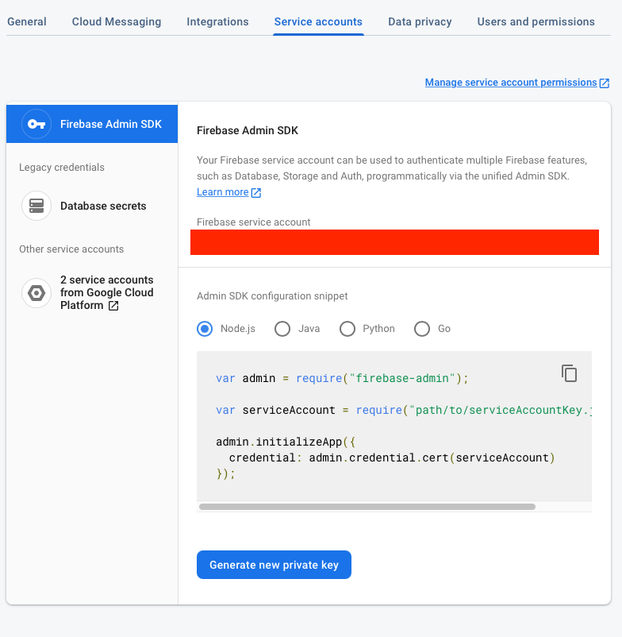
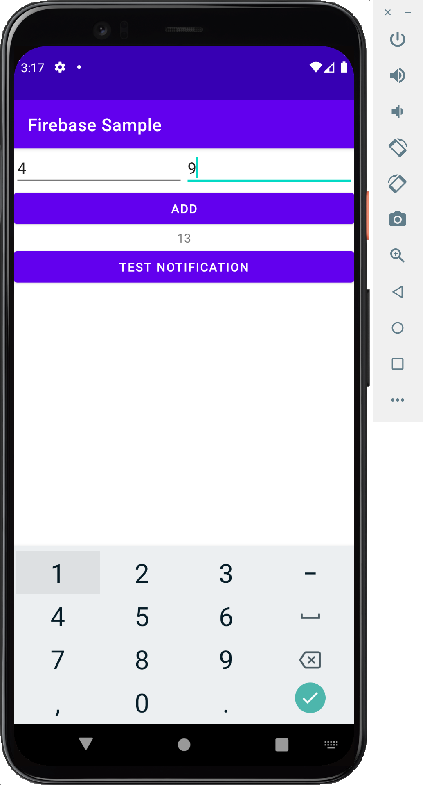

# Using Firebase for Android Authentication with Node.js
Firebase is a platform for mobile and web applications. It provides everything from databases and authentication to high level function like analytics and machine learning.

There are two elements to any Firebase application: the **admin sdk** element to be integrated with the frontend, and the **client sdk** to be integrated with the backend.

This tutorial will cover basic email authentication with Firebase.

This tutorial assumes you've already acquainted yourself with the tutorial at https://github.com/donn/mobile-apps-nodejs-skeleton.

Note that you're not intended to clone this tutorial and use it as a base, rather, you're supposed to incorporate elements of this tutorial into your own projects.

# Getting Started
Visit https://console.firebase.google.com.

Create a new project. Not a demo, just a plain new project. Call it whatever you want.

If you're worried about cost, Firebase has a free tier that should really be more than enough for anything in this tutorial.

## Enabling Authentication
1. Press on "Authentication" as shown. If you see some kind of Splash Screen with "Get Started", press it as well.
.
2. Under the "Sign-in method" tab, pick "Email/Password".


Note that you're free to enable other methods, but you're going to be mostly on your own.

## Backend Setup
Note: This section assumes you're 

1. Go into your Firebase project and click the cog ⚙️ button then "Project Settings".
	
2. Under the "Service accounts" tab, press the "Generate new private key" button. Download the file, rename it `admin-services.json` and copy it to the root of your Node.js project.
	

***NOTE: NEVER UPLOAD YOUR ADMIN-SERVICES.JSON FILE TO GITHUB. EVER.***

3. Go to your Node.js project in your favorite IDE then invoke `npm i firebase-admin`.
4. Copy the file in this repo's `Web/controllers/firebase.js` to your own project's controllers folder.
5. Add the following requires to your routes:
```js
const fb = require("../controllers/firebase.js");

const FirebaseApp = fb.FirebaseApp;
const FirebaseAuthentication = fb.FirebaseAuthentication;
```

You're basically done. To make a route authenticate, you only have to add this line before the .get and .post:

```js
router.use("/example_authenticated_api", FirebaseAuthentication); // <-- This one

router.post("/example_authenticated_api", function (req, res) {
// [...]
```

## Android Setup
For more in-depth instructions, check this guide: https://firebase.google.com/docs/auth/android/firebaseui

1. Register an Android application by pressing (+ Add app) and then the Android Logo.
	
	
2. The package name HAS to match the one you picked in Android Studio. The nickname can be anything.
	
3. Download the google-services.json. 
	
4. Open your app in Android Studio. Switch from Android View to Project View as follows:
	
5. Copy `google-services.json` to the `app/` folder.

***NOTE: NEVER UPLOAD YOUR GOOGLE-SERVICES.JSON FILE TO GITHUB EITHER. DON'T SAY I DIDN'T WARN YOU.***

6. Open your **project-wide gradle script** (i.e. `<root>/build.gradle`) and alter it as shown below. Ensure that you File > Sync Project with Gradle Files after you do so.
```java
buildscript {

  repositories {
    // Check that you have the following line (if not, add it):
    google()  // Google's Maven repository
  }

  dependencies {
    // [...]

    // ADD the following line:
    classpath 'com.google.gms:google-services:4.3.4'  // Google Services plugin
  }
}

allprojects {
  // [...]

  repositories {
    // Check that you have the following line (if not, add it):
    google()  // Google's Maven repository
    // [...]
  }
}
```
7. Open your **app-level gradle script** (i.e. `<root>/app/build.gradle`) and perform the following changes. Once again, ensure that you File > Sync Project with Gradle Files after you do so.
```java
// If you find "apply plugin: 'com.android.application'" then add this after:
apply plugin: 'com.google.gms.google-services' 

// If you find "plugins { id 'com.android.application' } then add the plugin like such:
plugins {
	id 'com.android.application'
	
	// ADD the following line:
	id 'com.google.gms.google-services'
	
	// [...]
}

dependencies {
	// [...]
	
	// ADD all of the following lines:
	implementation platform('com.google.firebase:firebase-bom:26.3.0')
	implementation 'com.google.firebase:firebase-auth'
	
	implementation 'com.firebaseui:firebase-ui-auth:6.4.0'
}
```
8. Create the activity you want to use for sign-in. There is a lot of code to add, frankly, and you can reference a fairly minimal example in this repo at: `Android/src/main/java/website/donn/firebasesample/MainActivity.java`.

9.  Ensure that you authenticate every request from now on. This is accomplished by adding an `Authentication` HTTP header with your request which has the value of `Token <the-token-here>`.

```java
FirebaseUser user = FirebaseAuth.getInstance().getCurrentUser();
user.getIdToken(true).addOnCompleteListener(task -> {
	if (!task.isSuccessful()) {
    // Failed to get token. Restart app or something
  }
  String idToken = task.getResult().getToken();
  
  // Add it to your request.
});

```
*		An example of adding the header using Volley is available at `Android/src/main/java/website/donn/firebasesample/AuthenticatedAddition.java`. Ensure that you also add the `Content-Type` header with the value `application/json` or else the backend will not be able to interpret your data correctly.

An entire sample Android app is available to cross-reference that just shows how the add API from https://github.com/donn/mobile-apps-nodejs-skeleton can incorporate authentication.


